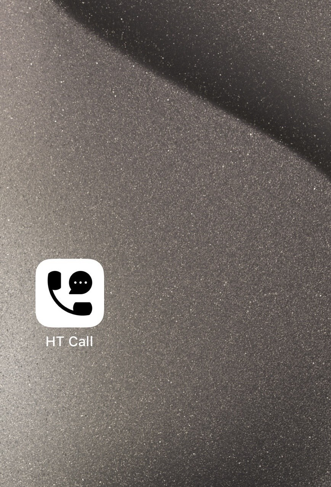
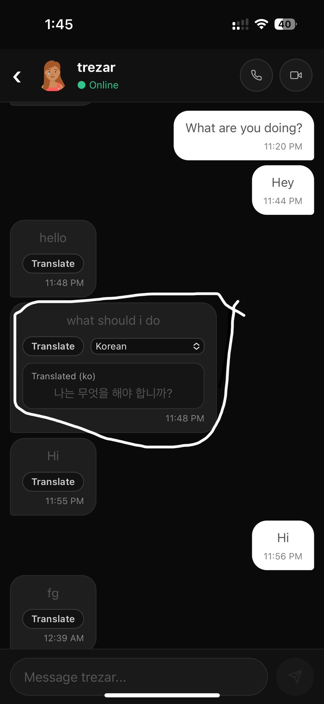
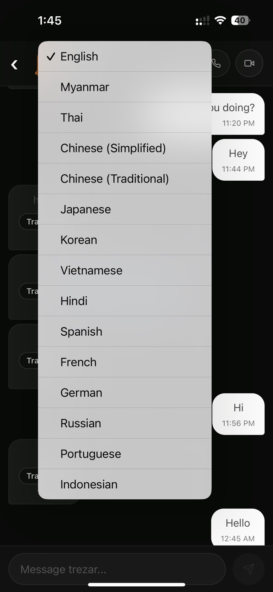
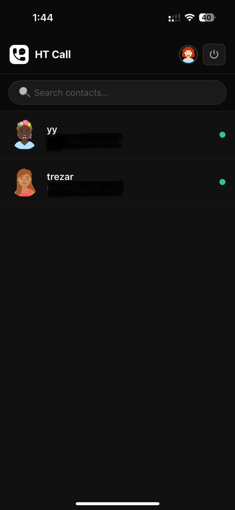

HT Call is a modern real-time communication app built for fast, simple, and reliable conversations. It supports
one-to-one messaging, crystal-clear voice calls, and video calls in a clean mobile-style interface designed for
everyday use.

With HT Call, users can sign up, connect instantly, and chat in real time with live typing status. The app includes
smart chat tools like on-demand message translation, so users can communicate across languages more easily. For
calling, HT Call offers both voice and video experiences with flexible UI behavior (popup and fullscreen), intuitive
in-call controls, and smoother call-state handling for actions like accept, decline, and end.

Powered by React, Firebase, and WebRTC (PeerJS), HT Call combines modern frontend performance with realtime backend
syncing to deliver a responsive, app-like experience on the web.

https://ht-call.web.app/

  
  
  
  

